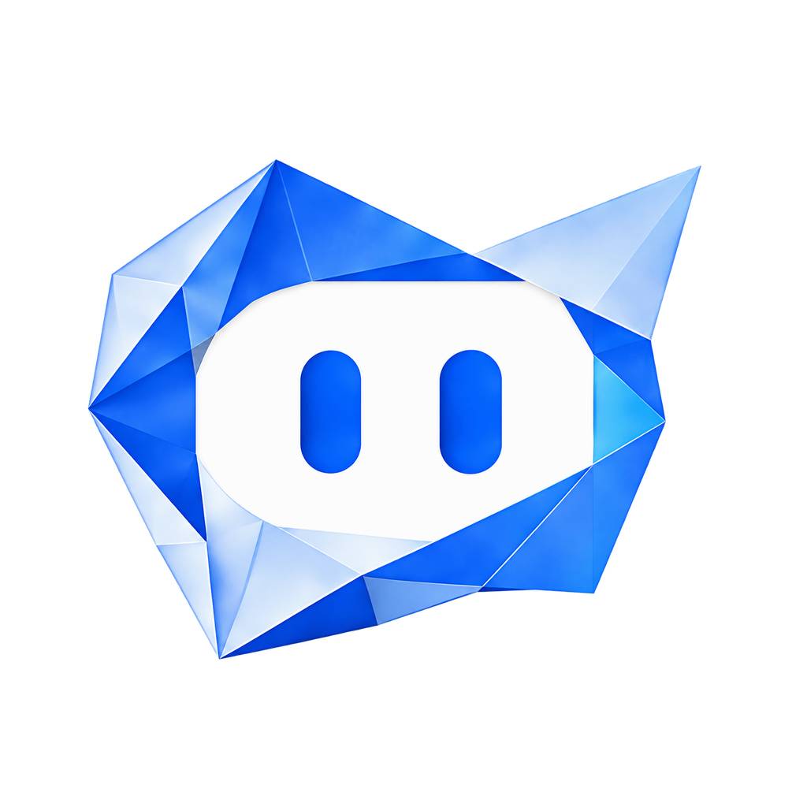

<p align="center">
  <a href="https://github.com/mhoo-os/mhoo-twenty-next">
    
  </a>
</p>

<h2 align="center">Mhoo — a governed distribution built on Twenty</h2>

<p align="center"><a href="https://github.com/mhoo-os/mhoo-twenty-next"> Mhoo source</a> · <a href="./packages/twenty-docker/helm/twenty/README.md"> Operator guide</a> · <a href="https://docs.twenty.com"> Upstream Twenty docs</a> · <a href="./docs/provenance/distribution-display-ledger.md"> Distribution ledger</a></p>

<br />

# Why Mhoo

Mhoo is the governed product distribution built on a clean Twenty foundation.
It keeps the upstream application framework, technical contracts, and upgrade
identity intact while giving customer-facing and operator-facing surfaces one
reviewed Mhoo presentation.

The source overlay is recorded in the [distribution display ledger](./docs/provenance/distribution-display-ledger.md). Legal publication, disposable
runtime proof, and release selection remain downstream gates.

<br />

# Installation

###  Source-compatible self-hosting

Use the governed Docker Compose source path while developing or preparing a
release:

```bash
cp packages/twenty-docker/.env.example .env
# Set SERVER_URL, PRODUCT_BRAND_DEPLOYMENT_ORIGIN, and the required secrets.
docker compose --env-file .env -f packages/twenty-docker/docker-compose.yml up -d
```

`PRODUCT_BRAND_PRESET=mhoo` is the distribution default. The deployment origin
must be the same `http(s)` origin as `SERVER_URL`, without a path or query.
This source path does not by itself claim public release or production proof.

###  Build an app

The app-development commands and package names intentionally retain their
technical Twenty identity:

```bash
npx create-twenty-app my-app
```

Define objects, fields, and views as code:

```ts
import { defineObject, FieldType } from 'twenty-sdk/define';

export default defineObject({
  nameSingular: 'deal',
  namePlural: 'deals',
  labelSingular: 'Deal',
  labelPlural: 'Deals',
  fields: [
    { name: 'name', label: 'Name', type: FieldType.TEXT },
    { name: 'amount', label: 'Amount', type: FieldType.CURRENCY },
    { name: 'closeDate', label: 'Close Date', type: FieldType.DATE_TIME },
  ],
});
```

Then ship it to your workspace:

```bash
npx twenty app:publish --private
```

See the [upstream Twenty app development guide](https://docs.twenty.com/developers/extend/apps/getting-started) for objects, views, agents, and logic functions.

###  Technical reference

For retained upstream framework behavior, consult the [upstream Twenty
Docker Compose guide](https://docs.twenty.com/developers/self-host/capabilities/docker-compose)
and [local setup guide](https://docs.twenty.com/developers/contribute/capabilities/local-setup).

<br />
<br />

# Upstream Twenty capabilities retained by this distribution

The inherited application surface provides the CRM building blocks, objects,
views, workflows, agents, and app extension points. The sections below retain
upstream technical examples; they are not separate Mhoo product claims.

Read the <a href="https://docs.twenty.com/user-guide/introduction"> Upstream Twenty user guide</a> for product walkthroughs, or the <a href="https://docs.twenty.com"> Upstream Twenty documentation</a> for developer reference.

<table align="center">
  <tr>
    <td width="50%">
      <picture>
        <source media="(prefers-color-scheme: dark)" srcset="./packages/twenty-website/public/images/readme/v2-build-apps-dark.webp" />
        <source media="(prefers-color-scheme: light)" srcset="./packages/twenty-website/public/images/readme/v2-build-apps-light.webp" />
        
      </picture>
      <p align="center"><a href="https://docs.twenty.com/developers/extend/apps/getting-started"> Learn more about apps in doc</a></p>
    </td>
    <td width="50%">
      <picture>
        <source media="(prefers-color-scheme: dark)" srcset="./packages/twenty-website/public/images/readme/v2-version-control-dark.webp" />
        <source media="(prefers-color-scheme: light)" srcset="./packages/twenty-website/public/images/readme/v2-version-control-light.webp" />
        
      </picture>
      <p align="center"><a href="https://docs.twenty.com/developers/extend/apps/publishing"> Learn more about version control in doc</a></p>
    </td>
  </tr>
  <tr>
    <td width="50%">
      <picture>
        <source media="(prefers-color-scheme: dark)" srcset="./packages/twenty-website/public/images/readme/v2-all-tools-dark.webp" />
        <source media="(prefers-color-scheme: light)" srcset="./packages/twenty-website/public/images/readme/v2-all-tools-light.webp" />
        
      </picture>
      <p align="center"><a href="https://docs.twenty.com/developers/extend/apps/building"> Learn more about primitives in doc</a></p>
    </td>
    <td width="50%">
      <picture>
        <source media="(prefers-color-scheme: dark)" srcset="./packages/twenty-website/public/images/readme/v2-tools-dark.webp" />
        <source media="(prefers-color-scheme: light)" srcset="./packages/twenty-website/public/images/readme/v2-tools-light.webp" />
        
      </picture>
      <p align="center"><a href="https://docs.twenty.com/user-guide/layout/overview"> Learn more about layouts in doc</a></p>
    </td>
  </tr>
  <tr>
    <td width="50%">
      <picture>
        <source media="(prefers-color-scheme: dark)" srcset="./packages/twenty-website/public/images/readme/v2-ai-agents-dark.webp" />
        <source media="(prefers-color-scheme: light)" srcset="./packages/twenty-website/public/images/readme/v2-ai-agents-light.webp" />
        
      </picture>
      <p align="center"><a href="https://docs.twenty.com/user-guide/ai/overview"> Learn more about AI in doc</a></p>
    </td>
    <td width="50%">
      <picture>
        <source media="(prefers-color-scheme: dark)" srcset="./packages/twenty-website/public/images/readme/v2-crm-tools-dark.webp" />
        <source media="(prefers-color-scheme: light)" srcset="./packages/twenty-website/public/images/readme/v2-crm-tools-light.webp" />
        
      </picture>
      <p align="center"><a href="https://docs.twenty.com/user-guide/introduction"> Learn more about CRM features in doc</a></p>
    </td>
  </tr>
</table>

<br />

# Stack

- <a href="https://www.typescriptlang.org/"> TypeScript</a>
- <a href="https://nx.dev/"> Nx</a>
- <a href="https://nestjs.com/"> NestJS</a>, with <a href="https://bullmq.io/">BullMQ</a>, <a href="https://www.postgresql.org/"> PostgreSQL</a>, <a href="https://redis.io/"> Redis</a>
- <a href="https://reactjs.org/"> React</a>, with <a href="https://jotai.org/">Jotai</a>, <a href="https://linaria.dev/">Linaria</a> and <a href="https://lingui.dev/">Lingui</a>

# Thanks

<p align="center">
  <a href="https://greptile.com"></a>
  &nbsp;&nbsp;&nbsp;&nbsp;
  <a href="https://sentry.io/"></a>
  &nbsp;&nbsp;&nbsp;&nbsp;
  <a href="https://crowdin.com/"></a>
</p>

Thanks to these amazing services that we use and recommend for code review (Greptile), catching bugs (Sentry) and translating (Crowdin).

# Join the upstream Twenty community

<p><a href="https://github.com/twentyhq/twenty"> Star the repo</a> · <a href="https://discord.gg/cx5n4Jzs57"> Discord</a> · <a href="https://github.com/twentyhq/twenty/discussions"> Feature requests</a> · <a href="https://github.com/orgs/twentyhq/projects/1/views/35"> Releases</a> · <a href="https://twitter.com/twentycrm"> X</a> · <a href="https://www.linkedin.com/company/twenty/"> LinkedIn</a> · <a href="https://twenty.crowdin.com/twenty"> Crowdin</a> · <a href="https://github.com/twentyhq/twenty/contribute"> Contribute</a></p>
